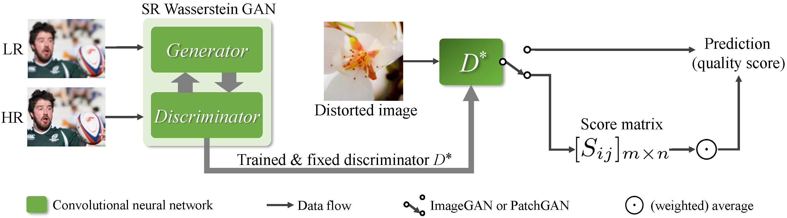
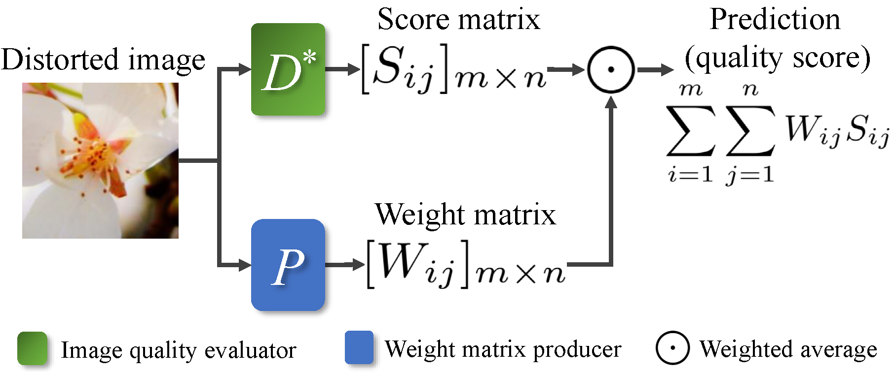

# RecycleD
Official PyTorch implementation of the paper "Recycling Discriminator: Towards Opinion-Unaware Image Quality Assessment Using Wasserstein GAN", accepted to ACM Multimedia 2021 Brave New Ideas (BNI) Track.

## Brief Introduction
**The core idea of RecycleD is to reuse the pre-trained discriminator in SR WGAN to directly assess the image perceptual quality.**



In addition, we use the Salient Object Detection (SOD) networks and Image Residuals to produce weight matrices to improve the PatchGAN discriminator.

<div align=center></div>

## Requirements
- Python 3.6
- NumPy 1.17
- PyTorch 1.2
- torchvision 0.4
- tensorboardX 1.4
- scikit-image 0.16
- Pillow 5.2
- OpenCV-Python 3.4
- SciPy 1.4

## Datasets
### For Training
We adopt the commonly used [DIV2K](https://data.vision.ee.ethz.ch/cvl/DIV2K/) as the training set to train SR WGAN.  
For training, we use the HR images in "DIV2K/DIV2K_train_HR/", and LR images in "DIV2K/DIV2K_train_LR_bicubic/X4/". (The upscale factor is x4.)  
For validation, we use the Set5 & Set14 datasets. You can download these benchmark datasets from [LapSRN project page](http://vllab.ucmerced.edu/wlai24/LapSRN/) or [My Baidu disk](https://pan.baidu.com/s/18QNVf-V6LHphK0sO4-Yf9w) with password ```srbm```.
### For Test
We use [PIPAL](https://www.jasongt.com/projectpages/pipal.html), [Ma's dataset](https://sites.google.com/site/chaoma99/sr-metric), [BAPPS-Superres](https://github.com/richzhang/PerceptualSimilarity#c-about-the-dataset) as super-resolved image quality datasets.  
We use [LIVE-itW](https://live.ece.utexas.edu/research/ChallengeDB/index.html) and [KonIQ-10k](http://database.mmsp-kn.de/koniq-10k-database.html) as artificially distorted image quality datasets.

## Getting Started
See the directory [shell](shell/).

## Pre-trained Models
- [Google drive](https://drive.google.com/drive/folders/1gv3zZgxcYliL9DPrtkJQAhrUTA-mE5Ge?usp=sharing).
- [Baidu disk](https://pan.baidu.com/s/1mftlQhQJu04j-bU1Wo_-Bg) with password ```ivg0```.

If you want to test the discriminators, you need to download the pre-trained models, and put them into the directory [pretrained_models](pretrained_models/).  
Meanwhile, you may need to modify the model location options in the [shell](shell/) scripts so that these model files can be loaded correctly.

## License
<a rel="license" href="http://creativecommons.org/licenses/by-nc/4.0/"></a>  
This work is licensed under a [Creative Commons Attribution-NonCommercial 4.0 International License](https://creativecommons.org/licenses/by-nc/4.0/).

## Citation
If you find this repository is useful for your research, please cite the following paper.

(1) BibTeX:
```
```

(2) ACM Reference Format:
```
Yunan Zhu, Haichuan Ma, Jialun Peng, Dong Liu, and Zhiwei Xiong. 2021.
Recycling Discriminator: Towards Opinion-Unaware Image Quality Assessment Using Wasserstein GAN.
In Proceedings of the 29th ACM International Conference on Multimedia (MM ’21), October 20–24, 2021, Virtual Event, China.
ACM, NewYork, NY, USA, 10 pages. https://doi.org/10.1145/3474085.3479234
```

## About Brave New Ideas (BNI) Track
Following paragraphs were directly excerpted from the [Call for Brave New Ideas of ACM Multimedia 2021](https://2021.acmmm.org/brave-new-ideas-proposals).
> The Brave New Ideas (BNI) Track of ACM Multimedia 2021 is calling for innovative papers that open up new vistas for multimedia research and stimulate activity towards addressing new, long term challenges of interest to the multimedia research community. Submissions should be scientifically rigorous and also introduce fresh perspectives.

> We understand "brave" to mean that a paper (or an area of research introduced by the paper) has great potential for high impact. For the proposed algorithm, technology or application to be understood as high impact, the authors should be able to argue that their proposal is important to solving problems, to supporting new perspectives, or to providing services that directly affect people's lives.

> We understand "new" to mean that an idea has not yet been proposed before. The component techniques and technologies may exist, but their integration must be novel.

> **BNI FAQ**  
> **1.What type of papers are suitable for the BNI track?**  
> The BNI track invites papers with brave and new ideas, where "brave" means “out-of-the-box thinking” ideas that may generate high impact and "new" means ideas not yet been proposed before. The highlight of BNI 2021 is "Multimedia for Social Good", where innovative research showcasing the benefit to the general public are encouraged.  
> **2.What is the format requirement for BNI papers?**  
> The paper format requirement is consistent with that of the regular paper.  
> **4.How selective is the BNI track?**  
> The BNI track is at least as competitive as the regular track. A BNI paper is regarded as respectful if not more compared to a regular paper. It is even more selective than the regular one with the acceptance rate at ~10% in previous years.  
> **6.How are the BNI papers published?**  
> The BNI papers are officially published in the conference proceeding.

## Acknowledgements
This code borrows partially from the repo [BasicSR](https://github.com/xinntao/BasicSR).  
We use the SOD networks from [BASNet](https://github.com/xuebinqin/BASNet) and [U-2-Net](https://github.com/xuebinqin/U-2-Net).
